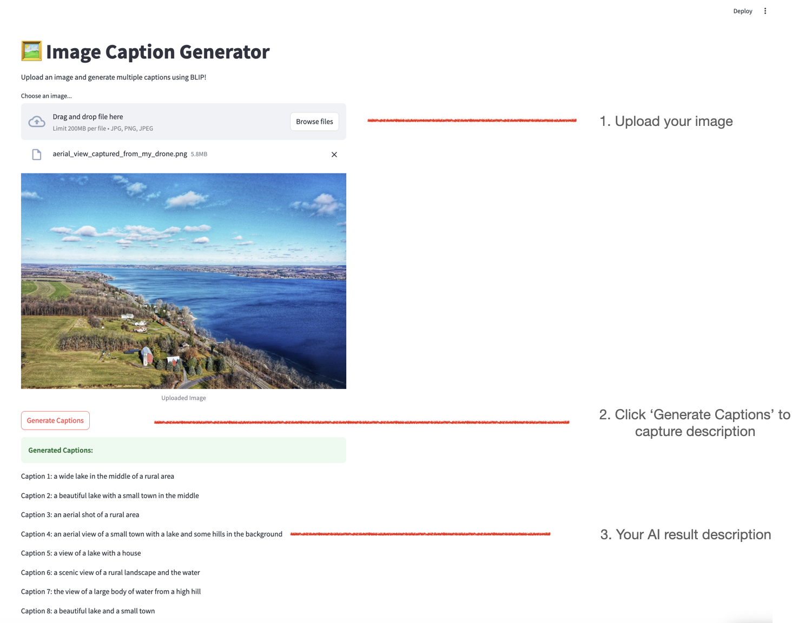

# 🖼️ Image Caption Generator (BLIP Model)

This repository contains a Streamlit web application that generates image captions using the BLIP (Bootstrapped Language-Image Pretraining) model from Hugging Face.

With this app, users can upload an image, and the model will generate multiple captions describing the image. The captions are generated using sampling techniques to ensure diversity.

# Features

* Upload an image using an easy-to-use UI.
* Generate multiple unique captions per image.
* Uses BLIP (Hugging Face) for high-quality captions.
* Customizable captioning settings (temperature, top-k, top-p).
* Organized codebase with a modular structure.

# How to run?

`streamlit run app.py`

# Sample Expected Outputs



# Project Directory Structure

The repository is well-organized for scalability and maintainability:

```
image_captioning_app/
│── models/                      # Model loading logic
│   ├── blip_model.py             # Loads the BLIP model
│── utils/                        # Utility functions
│   ├── caption_generator.py      # Handles image caption generation
│── app.py                        # Main Streamlit app
│── requirements.txt              # Dependencies for the project
│── data/                         # Sample images (optional)
│── README.md                     # Project documentation
```

# Model Information - Hugging Face 

https://huggingface.co/Salesforce/blip-image-captioning-base

# What is BLIP and What Does It Do?

**Imagine This...**

If you show a picture of a dog to a child and ask, "What do you see?", the child might say:

    "A cute dog sitting on the grass."
    "A brown puppy looking at the camera."
    "A fluffy dog in a park."

The BLIP model does the same thing! It "looks" at the image and automatically generates captions describing what’s in the image.

**How BLIP Works in Simple Terms**

BLIP is a AI model that combines vision and language. It analyzes an image and describes it in words, just like a person would.

1. It "sees" the image: BLIP uses a Vision Transformer (ViT) to analyze the image and understand the objects in it. It doesn't just detect objects like "dog" or "grass" — it understands the relationship between them (e.g., "A dog sitting on the grass").

2. It "thinks" about what it sees: It compares the image with millions of past images it has learned from. It finds the best words to describe the image based on its training.

3. It "writes" a caption: BLIP then generates a natural sentence that describes the image. Instead of just saying "dog, grass," it forms full, meaningful captions like:
    
    "A golden retriever sitting in a park."
    "A happy dog playing on the grass on a sunny day."


